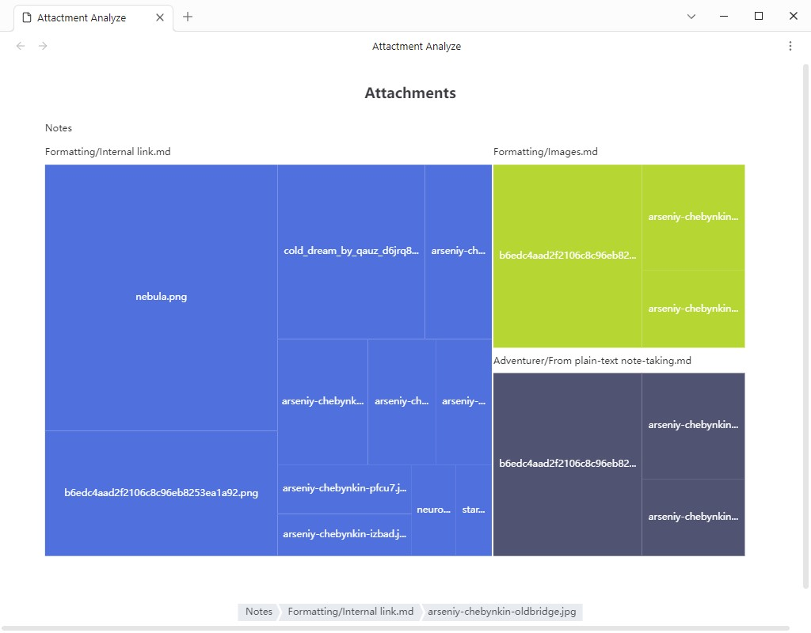

# 📦 obsidian-attachment-analyzer

A plugin for Obsidian that analyzes the disk usage of your note attachments and visualizes the results using a Treemap chart.

## ✨ Features

- Scans all attachments in your Obsidian vault (images, PDFs, audio files, etc.)
- Calculates and displays file sizes
- Visualizes disk usage with an interactive Treemap
- Helps identify large files at a glance

## 📸 Screenshot

## 💬 Feedback & Contributions

Feel free to open issues or submit pull requests. Suggestions and improvements are always welcome!